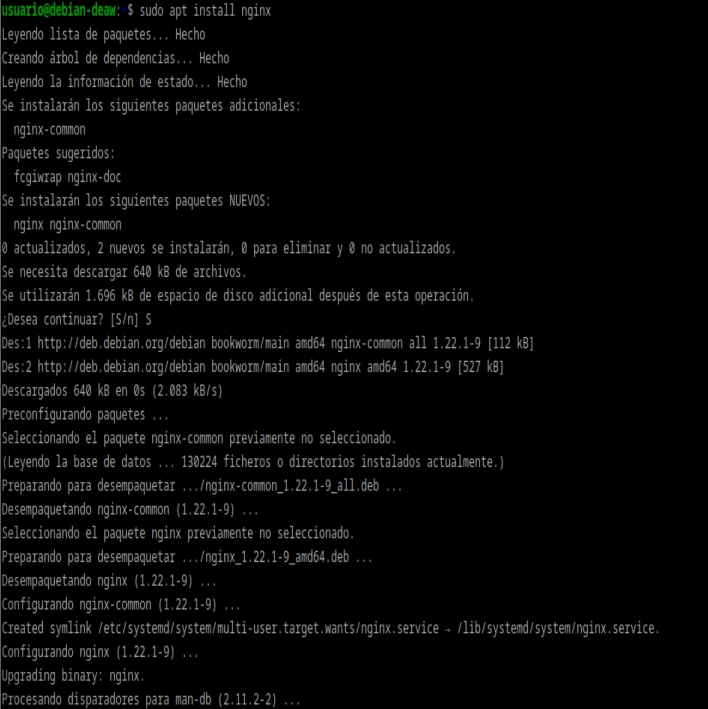
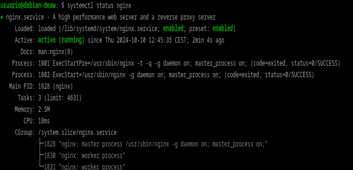
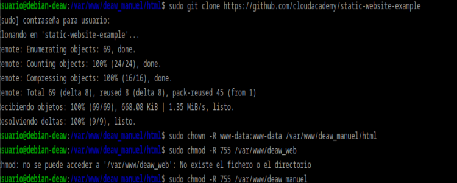
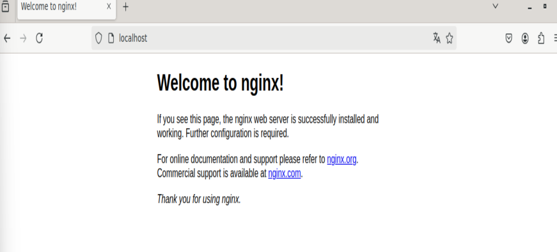

# PRACTICA 2.1: Instalación y configuración de un servidor web Nginx

## INSTALACION NGINX

Comprobamos que esté funcionando:

## CREACION DEL DIRECTORIO DEL SITIO WEB

Creamos el directorio y haremos que el propietario de esta carpeta y todo lo que haya dentro sea el usuario www-data, además de proporcionarle los permisos pertinentes.
Además clonamos el siguiente repositorio en este:

Ahora entramos al navegador con nuestra ip y nos sale lo siguiente:

