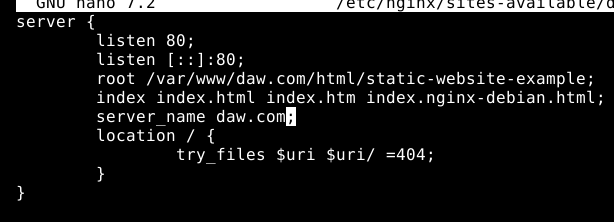
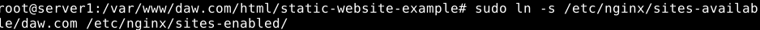
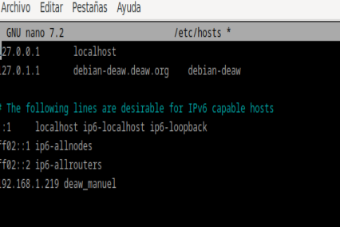
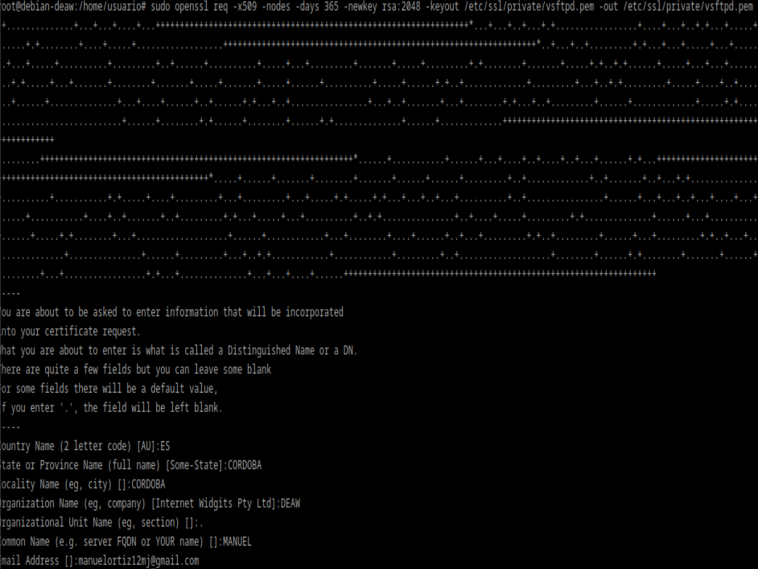
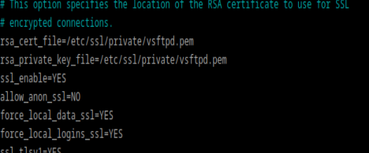
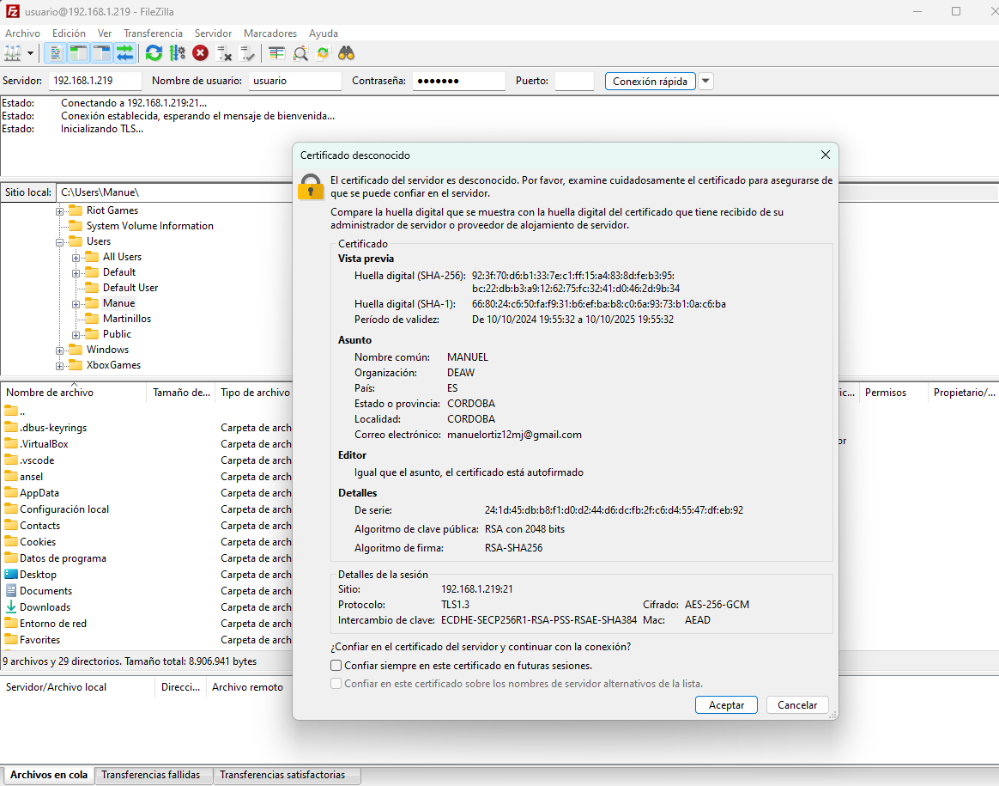

# PRACTICA 2.1: Instalación y configuración de un servidor web Nginx

## INSTALACION NGINX


Comprobamos que esté funcionando:


## CREACION DEL DIRECTORIO DEL SITIO WEB

Creamos el directorio y haremos que el propietario de esta carpeta y todo lo que haya dentro sea el usuario www-data, además de proporcionarle los permisos pertinentes.
Además clonamos el siguiente repositorio en este:


Ahora entramos al navegador con nuestra ip y nos sale lo siguiente:


## CONFIGURACION DEL SERVIDOR WEB NGINX

Debemos modificar el siguiente archivo:
```
/etc/nginx/sites-available/vuestro_dominio
```



Primero antes de nada modificaremos el archivo /etc/hosts para que nuestra máquina anfitriona asocie la IP de la máquina virtual con el nombre del servidor



Y comprobaremos los logs.

## CONFIGURAR SERVIDOR SFTP EN DEBIAN

Primero instalamos vsftpd y creamos una carpeta /ftp en el home de la máquina virtual.

Después creamos los certificados de seguridad necesarios para aportar la capa de cifrado a nuestra conexión.



A continuación realizaremos la configuración de vsftpd

Abrimos el siguiente archivo de configuracion:


Y añadimos lo siguiente:



Y reiniciamos.

## AÑADIR ARCHIVOS MEDIANTE FILEZILLA

Descargamos filezilla en nuestro pc y le ponemos las siguientes especificaciones:



Conectamos y ya podremos transferir archivos con la máquina virtual.